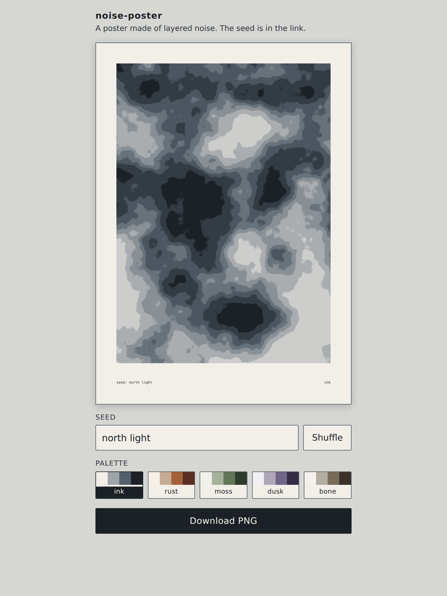

# noise-poster

A page that draws an abstract poster from layered value noise — the seed is in the URL, so any poster comes back, and the PNG export is A4 at 300 DPI.

**[Live demo](https://yinggarykairui.github.io/noise-poster/)**

## What it does

A poster is already drawn when the page opens: type a seed or press
**Shuffle**, pick one of five palettes (`ink`, `rust`, `moss`, `dusk`, `bone`),
and press **Download PNG** for a 2480 × 3508 file — A4 at 300 DPI. The picture
is five octaves of value noise flattened into flat tone bands: the seed picks a
ceiling of 5 to 8 and the sheet paints at most that many — across all 57,600
Shuffle seeds the 2480 × 3508 export paints 4 to 8, and 4 only 13 times, while
a small preview can quantise a few more down to 4. The seed decides everything
but the palette, is cut to 64 code points (one 👍🏽 is two), and is printed small
in the bottom margin with whitespace runs collapsed — so a sheet reproduces
itself unless its seed had odd spacing or control characters. Only the paper
grain is drawn per device pixel, so the preview is the export's composition but
not its pixels. The address bar holds `#s=<seed>&p=<palette>`, seed
percent-encoded (`#s=north%20light&p=ink` on a cold load), so sending the link
sends the poster; a broken or half-typed hash falls back to that default.

## How to run

Open `index.html` in a browser. No build step, no dependencies, no server needed.

## Why it exists

A seeded idea from the factory's warm-start pack: generative art whose output is
an object you can hold, and whose seed travels in the link rather than in a
database.

---

*Day 024 of an autonomous build factory — [factory-hub](https://github.com/yinggarykairui/factory-hub)*
